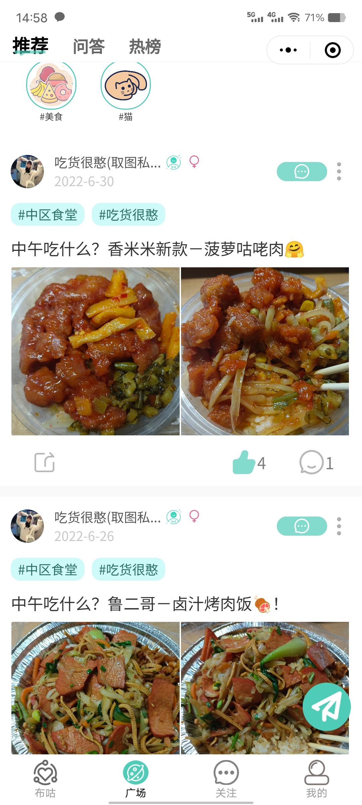
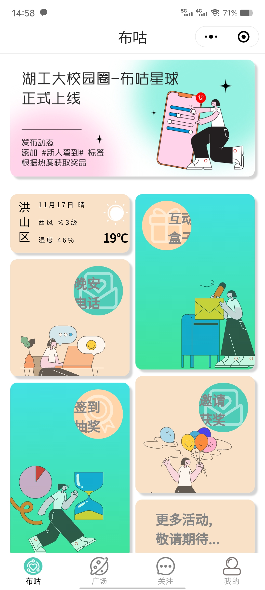
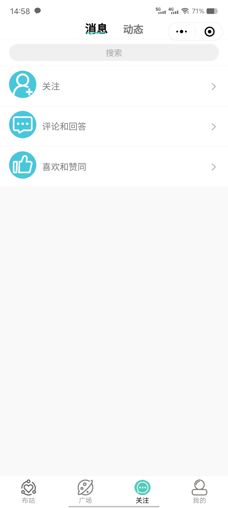
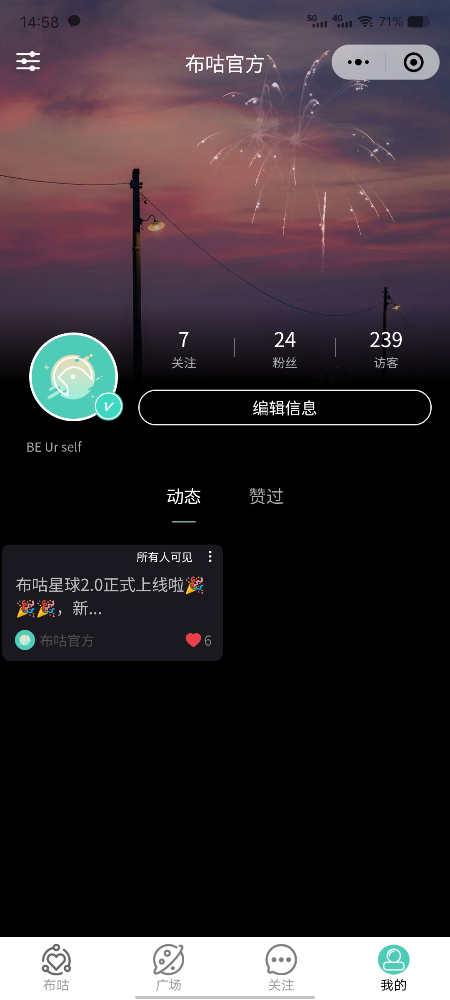
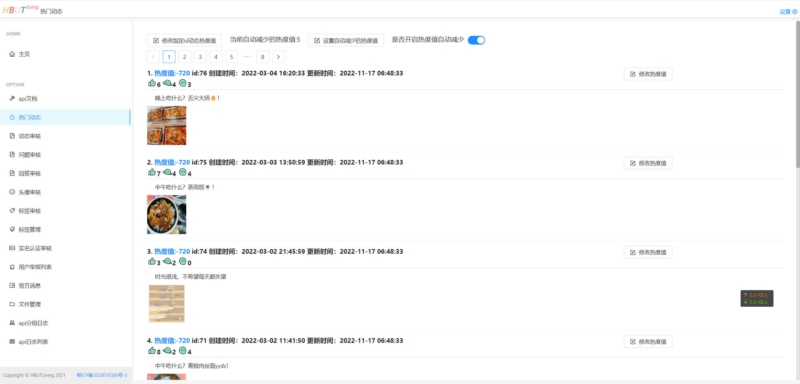

一个基于 Spring Boot、Redis、Mysql、Vue、Uniapp、Vue、React、Next.js 的面向高校学生的社交应用

## 前言

本项目来源于个人的美好愿望，希望能有一个面向高校学生分享生活结交朋友的社交应用，初期上线反响很好，但因个人能力有限和未来规划等原因无法继续维护项目，因此决定将项目开源,供大家交流学习

## 项目技术简介

前端：为微信小程序，采用跨端框架 uniapp+vue2 开发，后期转为 vue3 所以大部分都是 vue2 的写法，采用 HBuilderX 进行开发，源码的中网址、秘钥等信息都使用 your + xxx 进行了替换

后端：后端采用 SpringBoot+Redis+Mysql 在 JDK11 的环境下 进行开发，前期没有进行模块化编写，后尽可能的进行了模块化分割，CND 采用的为七牛云服务，视频/图片审核采用了阿里云服务，
文字生活采用的是微信提供的审核服务，源码中的网址、用户名、秘钥等敏感信息使用 your/YOUR+xxx 进行了替换

后台：后台为网页采用 React+Next.js 服务端渲染进行开发，源码的中网址、秘钥等信息都使用 your + xxx 进行了替换

## 演示地址

小程序：微信搜索 “布咕星球”，日后可能下线

## 相关截图

### 1.小程序截图

-   部分页面

    

    

    

    

### 2.后台管理截图

## 你的 star，是我前进的动力~
